# Battle System Design Document
**Project**: WildMonster  
**Author**: Lead Gameplay Engineer  
**Date**: 2025-12-30  
**Version**: 1.0

---

## Executive Summary

This document outlines the redesign of WildMonster's turn-based combat system using a **Stack Machine architecture** and **State Pattern** to ensure bug-free state transitions, competitive balance, and extensibility. The current implementation relies on simple event-driven logic with cooldown timers. The proposed system introduces structured state management, command pattern for actions, and a robust damage calculation pipeline.

---

## Current System Analysis

### Existing Implementation
- **Location**: [`combat.ts`](file:///c:/wildMonster/domain/combat.ts), [`BattleScene.ts`](file:///c:/wildMonster/engine/scenes/BattleScene.ts)
- **Architecture**: Event-driven with Phaser timers
- **Turn Logic**: Simultaneous action (no strict turn order)
- **Damage Calculation**: Simple formula in `calculateDamage()`
- **State Management**: Direct entity mutation

### Identified Issues
1. **No Turn Order System**: Player and enemy act independently via timers
2. **Limited State Control**: No formal state machine for battle phases
3. **Hardcoded Logic**: Skill effects and damage modifiers scattered across codebase
4. **No Undo/Replay**: Actions are irreversible
5. **Edge Cases**: Speed ties, faint interrupts, status timing undefined

---

## Proposed Architecture

### 1. State Machine Design

#### State Pattern Hierarchy

```mermaid
classDiagram
    class BattleState {
        <<abstract>>
        +enter(context: BattleContext)
        +execute(context: BattleContext)
        +exit(context: BattleContext)
        +canTransition(to: BattleState): boolean
    }
    
    class BattleInitState {
        +enter() Initialize entities
        +execute() Transition to TurnStart
    }
    
    class TurnStartState {
        +enter() Calculate turn order
        +execute() Determine first actor
    }
    
    class PlayerInputState {
        +enter() Enable UI
        +execute() Wait for player action
        +exit() Disable UI
    }
    
    class EnemyAIState {
        +enter() Run AI decision
        +execute() Select action
    }
    
    class ActionExecutionState {
        +enter() Lock entities
        +execute() Process command
        +exit() Apply effects
    }
    
    class DamageResolutionState {
        +enter() Calculate damage
        +execute() Apply HP changes
        +exit() Check faint
    }
    
    class StatusEffectState {
        +enter() Process status effects
        +execute() Apply DOT/buffs
    }
    
    class TurnEndState {
        +enter() Update cooldowns
        +execute() Check win/loss
    }
    
    class BattleEndState {
        +enter() Calculate rewards
        +execute() Cleanup
    }
    
    BattleState <|-- BattleInitState
    BattleState <|-- TurnStartState
    BattleState <|-- PlayerInputState
    BattleState <|-- EnemyAIState
    BattleState <|-- ActionExecutionState
    BattleState <|-- DamageResolutionState
    BattleState <|-- StatusEffectState
    BattleState <|-- TurnEndState
    BattleState <|-- BattleEndState
```



#### State Transition Flow


---

### 2. Stack Machine Implementation

#### BattleStateStack Class

The stack machine manages nested battle states (e.g., interrupts, multi-hit attacks, counter-attacks).

**Pseudocode**:

```typescript
class BattleStateStack {
  private stack: BattleState[] = [];
  private context: BattleContext;

  constructor(context: BattleContext) {
    this.context = context;
  }

  // Push a new state onto the stack
  Push(state: BattleState): void {
    // Exit current state if exists
    if (this.stack.length > 0) {
      this.Peek().exit(this.context);
    }
    
    // Add new state and enter
    this.stack.push(state);
    state.enter(this.context);
    
    // Log for debugging
    console.log(`[Stack] Pushed: ${state.constructor.name} (Depth: ${this.stack.length})`);
  }

  // Remove and return the top state
  Pop(): BattleState | null {
    if (this.stack.length === 0) {
      console.warn('[Stack] Attempted to pop from empty stack');
      return null;
    }
    
    const state = this.stack.pop()!;
    state.exit(this.context);
    
    console.log(`[Stack] Popped: ${state.constructor.name} (Depth: ${this.stack.length})`);
    
    // Re-enter previous state if exists
    if (this.stack.length > 0) {
      this.Peek().enter(this.context);
    }
    
    return state;
  }

  // View the top state without removing
  Peek(): BattleState | null {
    if (this.stack.length === 0) return null;
    return this.stack[this.stack.length - 1];
  }

  // Execute the current state's logic
  Execute(): void {
    const current = this.Peek();
    if (!current) {
      console.warn('[Stack] No state to execute');
      return;
    }
    
    current.execute(this.context);
  }

  // Check if stack is empty
  IsEmpty(): boolean {
    return this.stack.length === 0;
  }

  // Clear all states (for battle end)
  Clear(): void {
    while (!this.IsEmpty()) {
      this.Pop();
    }
  }

  // Get current stack depth (for debugging)
  GetDepth(): number {
    return this.stack.length;
  }
}
```

**Usage Example**:

```typescript
// Initialize battle
const context = new BattleContext(playerEntity, enemyEntity);
const stateStack = new BattleStateStack(context);

// Start battle
stateStack.Push(new BattleInitState());
stateStack.Execute(); // Initializes entities

// Transition to turn start
stateStack.Pop();
stateStack.Push(new TurnStartState());
stateStack.Execute(); // Calculates turn order

// Handle nested states (e.g., counter-attack)
stateStack.Push(new ActionExecutionState(playerAttackCommand));
stateStack.Execute(); // Player attacks

// Enemy has counter-attack ability
if (enemyHasCounter) {
  stateStack.Push(new ActionExecutionState(enemyCounterCommand));
  stateStack.Execute(); // Counter-attack resolves
  stateStack.Pop(); // Return to original attack resolution
}

stateStack.Pop(); // Complete player action
```

---

### 3. Command Pattern for Actions

#### ICommand Interface

All battle actions (attack, item, switch) implement this interface for **undo/replay** support.

```typescript
interface ICommand {
  // Unique identifier for this command
  readonly id: string;
  
  // Actor performing the command
  readonly actor: CombatEntity;
  
  // Target(s) of the command
  readonly targets: CombatEntity[];
  
  // Execute the command
  Execute(context: BattleContext): CommandResult;
  
  // Undo the command (for replay/debugging)
  Undo(context: BattleContext): void;
  
  // Validate if command can be executed
  CanExecute(context: BattleContext): boolean;
  
  // Serialize for replay system
  Serialize(): string;
}

interface CommandResult {
  success: boolean;
  effects: BattleEffect[];
  log: string[];
}

interface BattleEffect {
  type: 'DAMAGE' | 'HEAL' | 'BUFF' | 'DEBUFF' | 'STATUS' | 'FAINT';
  target: string; // Entity UID
  value: number;
  metadata?: Record<string, any>;
}
```

#### Concrete Command Implementations

```typescript
class AttackCommand implements ICommand {
  readonly id: string;
  readonly actor: CombatEntity;
  readonly targets: CombatEntity[];
  private skillId: string;
  
  constructor(actor: CombatEntity, target: CombatEntity, skillId: string) {
    this.id = `attack_${Date.now()}_${Math.random()}`;
    this.actor = actor;
    this.targets = [target];
    this.skillId = skillId;
  }
  
  CanExecute(context: BattleContext): boolean {
    // Check cooldown
    if ((this.actor.cooldowns[this.skillId] || 0) > 0) {
      return false;
    }
    
    // Check if actor is alive
    if (this.actor.hp <= 0) {
      return false;
    }
    
    // Check if skill exists
    const skill = SKILL_DATA[this.skillId];
    return skill !== undefined;
  }
  
  Execute(context: BattleContext): CommandResult {
    const target = this.targets[0];
    const skill = SKILL_DATA[this.skillId];
    
    // Calculate damage using DamageCalculator
    const damage = DamageCalculator.Calculate(
      this.actor,
      target,
      skill,
      context.weather,
      context.terrain
    );
    
    // Apply damage
    target.hp = Math.max(0, target.hp - damage);
    
    // Set cooldown
    this.actor.cooldowns[this.skillId] = skill.cooldown;
    
    // Create effect record
    const effects: BattleEffect[] = [{
      type: 'DAMAGE',
      target: target.uid,
      value: damage,
      metadata: { skillId: this.skillId, skillName: skill.name }
    }];
    
    // Check faint
    if (target.hp === 0) {
      effects.push({
        type: 'FAINT',
        target: target.uid,
        value: 0
      });
    }
    
    return {
      success: true,
      effects,
      log: [`${this.actor.name} used ${skill.name}!`, `${target.name} took ${damage} damage!`]
    };
  }
  
  Undo(context: BattleContext): void {
    // Restore HP (for replay/debugging)
    // Implementation depends on snapshot system
  }
  
  Serialize(): string {
    return JSON.stringify({
      type: 'ATTACK',
      actorUid: this.actor.uid,
      targetUid: this.targets[0].uid,
      skillId: this.skillId,
      timestamp: Date.now()
    });
  }
}

class ItemCommand implements ICommand {
  readonly id: string;
  readonly actor: CombatEntity;
  readonly targets: CombatEntity[];
  private itemId: string;
  
  constructor(actor: CombatEntity, target: CombatEntity, itemId: string) {
    this.id = `item_${Date.now()}_${Math.random()}`;
    this.actor = actor;
    this.targets = [target];
    this.itemId = itemId;
  }
  
  CanExecute(context: BattleContext): boolean {
    // Check inventory
    const item = context.inventory.find(i => i.itemId === this.itemId);
    return item !== undefined && item.quantity > 0;
  }
  
  Execute(context: BattleContext): CommandResult {
    const item = ITEM_DATA[this.itemId];
    const target = this.targets[0];
    
    // Apply item effect
    if (item.category === 'Healing') {
      const healAmount = item.power;
      target.hp = Math.min(target.maxHp, target.hp + healAmount);
      
      return {
        success: true,
        effects: [{
          type: 'HEAL',
          target: target.uid,
          value: healAmount
        }],
        log: [`Used ${item.name}!`, `${target.name} restored ${healAmount} HP!`]
      };
    }
    
    // Handle other item types...
    return { success: false, effects: [], log: [] };
  }
  
  Undo(context: BattleContext): void {
    // Restore item to inventory
  }
  
  Serialize(): string {
    return JSON.stringify({
      type: 'ITEM',
      actorUid: this.actor.uid,
      targetUid: this.targets[0].uid,
      itemId: this.itemId
    });
  }
}

class SwitchCommand implements ICommand {
  readonly id: string;
  readonly actor: CombatEntity;
  readonly targets: CombatEntity[];
  private newMonsterUid: string;
  
  constructor(actor: CombatEntity, newMonsterUid: string) {
    this.id = `switch_${Date.now()}`;
    this.actor = actor;
    this.targets = [];
    this.newMonsterUid = newMonsterUid;
  }
  
  CanExecute(context: BattleContext): boolean {
    // Check if monster exists in party and is alive
    const newMonster = context.party.find(m => m.uid === this.newMonsterUid);
    return newMonster !== undefined && newMonster.currentHp > 0;
  }
  
  Execute(context: BattleContext): CommandResult {
    const newMonster = context.party.find(m => m.uid === this.newMonsterUid)!;
    
    // Swap active monster
    context.activeMonster = newMonster;
    
    return {
      success: true,
      effects: [],
      log: [`Switched to ${newMonster.name}!`]
    };
  }
  
  Undo(context: BattleContext): void {
    // Restore previous active monster
  }
  
  Serialize(): string {
    return JSON.stringify({
      type: 'SWITCH',
      actorUid: this.actor.uid,
      newMonsterUid: this.newMonsterUid
    });
  }
}
```

---

## Battle Flow Diagram


---

## Edge Case Handling

### 1. Speed Tie Resolution

**Problem**: When player and enemy have identical speed stats, who acts first?

**Solution**:
```typescript
class TurnStartState extends BattleState {
  execute(context: BattleContext): void {
    const playerSpeed = this.calculateEffectiveSpeed(context.player);
    const enemySpeed = this.calculateEffectiveSpeed(context.enemy);
    
    if (playerSpeed > enemySpeed) {
      context.turnOrder = ['player', 'enemy'];
    } else if (enemySpeed > playerSpeed) {
      context.turnOrder = ['enemy', 'player'];
    } else {
      // Speed tie: 50/50 random
      context.turnOrder = Math.random() < 0.5 
        ? ['player', 'enemy'] 
        : ['enemy', 'player'];
      
      context.log.push('Speed tie! Random turn order determined.');
    }
  }
  
  private calculateEffectiveSpeed(entity: CombatEntity): number {
    let speed = entity.stats.speed;
    
    // Apply speed buffs
    entity.buffs.forEach(buff => {
      if (buff.effect === 'BUFF_SPD') speed += buff.power;
    });
    
    // Apply paralysis penalty
    if (entity.status?.type === 'PARALYSIS') {
      speed = Math.floor(speed * 0.5);
    }
    
    return speed;
  }
}
```

### 2. Faint During Multi-Hit Attack

**Problem**: If a monster faints on hit 2 of a 3-hit attack, should hits 3 continue?

**Solution**:
```typescript
class MultiHitAttackCommand implements ICommand {
  Execute(context: BattleContext): CommandResult {
    const results: CommandResult[] = [];
    const hitCount = this.getHitCount(); // e.g., 2-5 random hits
    
    for (let i = 0; i < hitCount; i++) {
      // Check if target is still alive before each hit
      if (this.targets[0].hp <= 0) {
        context.log.push(`${this.targets[0].name} has already fainted!`);
        break; // Stop remaining hits
      }
      
      // Execute single hit
      const hitResult = this.executeSingleHit(context, i + 1);
      results.push(hitResult);
      
      // Check faint after each hit
      if (this.targets[0].hp === 0) {
        context.log.push(`${this.targets[0].name} fainted!`);
        break; // Stop remaining hits
      }
    }
    
    return this.mergeResults(results);
  }
}
```

### 3. Status Effect Timing

**Problem**: When do burn/poison damage apply? Turn start, turn end, or after action?

**Solution**: **Standardize to Turn End** (after all actions)

```typescript
class TurnEndState extends BattleState {
  execute(context: BattleContext): void {
    // 1. Update cooldowns
    this.updateCooldowns(context);
    
    // 2. Process status effects (DOT)
    this.processStatusEffects(context);
    
    // 3. Tick buff durations
    this.updateBuffs(context);
    
    // 4. Check win/loss
    if (this.checkBattleEnd(context)) {
      context.stateStack.Push(new BattleEndState());
    } else {
      context.stateStack.Push(new TurnStartState());
    }
  }
  
  private processStatusEffects(context: BattleContext): void {
    [context.player, context.enemy].forEach(entity => {
      if (!entity.status) return;
      
      switch (entity.status.type) {
        case 'BURN':
          const burnDamage = Math.floor(entity.maxHp * 0.0625); // 1/16 max HP
          entity.hp = Math.max(0, entity.hp - burnDamage);
          context.log.push(`${entity.name} is hurt by burn! (-${burnDamage} HP)`);
          break;
          
        case 'POISON':
          const poisonDamage = Math.floor(entity.maxHp * 0.125); // 1/8 max HP
          entity.hp = Math.max(0, entity.hp - poisonDamage);
          context.log.push(`${entity.name} is hurt by poison! (-${poisonDamage} HP)`);
          break;
          
        case 'REGEN':
          const healAmount = Math.floor(entity.maxHp * 0.0625);
          entity.hp = Math.min(entity.maxHp, entity.hp + healAmount);
          context.log.push(`${entity.name} restored HP! (+${healAmount} HP)`);
          break;
      }
      
      // Tick status duration
      entity.status.turnsRemaining--;
      if (entity.status.turnsRemaining <= 0) {
        context.log.push(`${entity.name}'s ${entity.status.type} wore off!`);
        entity.status = null;
      }
    });
  }
}
```

### 4. Priority Moves

**Problem**: Some skills should always go first regardless of speed (e.g., Quick Attack).

**Solution**:
```typescript
interface Skill {
  // ... existing fields
  priority: number; // Default 0, higher = faster
}

class TurnStartState extends BattleState {
  execute(context: BattleContext): void {
    const playerPriority = this.getCommandPriority(context.playerCommand);
    const enemyPriority = this.getCommandPriority(context.enemyCommand);
    
    // Priority takes precedence over speed
    if (playerPriority > enemyPriority) {
      context.turnOrder = ['player', 'enemy'];
    } else if (enemyPriority > playerPriority) {
      context.turnOrder = ['enemy', 'player'];
    } else {
      // Same priority: use speed
      this.resolveBySpeed(context);
    }
  }
  
  private getCommandPriority(command: ICommand): number {
    if (command instanceof AttackCommand) {
      const skill = SKILL_DATA[command.skillId];
      return skill.priority || 0;
    }
    return 0; // Items/switches have normal priority
  }
}
```

---

## Class Diagram


---

## Implementation Checklist

- [ ] Create `BattleState` abstract class
- [ ] Implement all concrete state classes (9 states)
- [ ] Build `BattleStateStack` class
- [ ] Define `ICommand` interface
- [ ] Implement `AttackCommand`, `ItemCommand`, `SwitchCommand`
- [ ] Create `DamageCalculator` static class (see [Damage_Formula_Spec.md](file:///C:/Users/rlagj/.gemini/antigravity/brain/6b6ad7cb-99fc-4230-81aa-b2c88afdbb4e/Damage_Formula_Spec.md))
- [ ] Integrate type chart system
- [ ] Add priority move support
- [ ] Implement status effect timing
- [ ] Add speed tie resolution
- [ ] Handle multi-hit faint edge case
- [ ] Create replay system using serialized commands
- [ ] Write unit tests for state transitions
- [ ] Write integration tests for full battle flow

---

## References

- [6] Stack Machine Architecture Pattern
- [9] Command Pattern for Undo/Replay
- [12] Dependency Injection for Type Charts
- Current Implementation: [`combat.ts`](file:///c:/wildMonster/domain/combat.ts), [`BattleScene.ts`](file:///c:/wildMonster/engine/scenes/BattleScene.ts)
- Type Definitions: [`types.ts`](file:///c:/wildMonster/domain/types.ts)
- Skill Data: [`skills.ts`](file:///c:/wildMonster/data/skills.ts)
