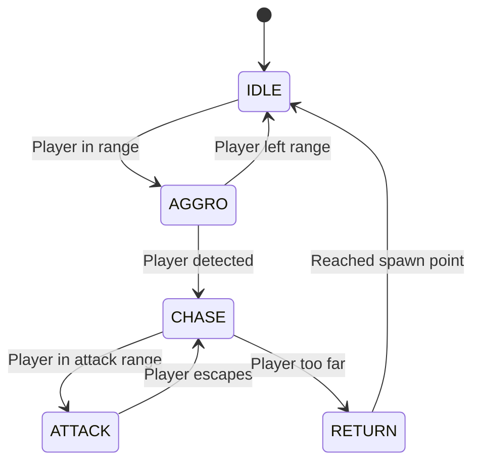

# WildMonster 리팩토링 계획서
**프로젝트**: WildMonster  
**작성자**: Lead Gameplay Engineer  
**날짜**: 2025-12-30  
**버전**: 2.0 (턴제 → 오픈월드 전환)

---

## 개요

WildMonster를 **턴제 전투 중심 게임**에서 **오픈월드 와일더 RPG**로 전환합니다. 이 문서는 아키텍처 변경사항과 구현 계획을 정의합니다.

---

## 현재 구조 분석

### 기존 아키텍처

```
OverworldScene (탐험)
    ↓ 몬스터 조우
BattleScene (턴제 전투)
    ↓ 승리/패배
OverworldScene (복귀)
```

**특징**:
- ✅ 명확한 Scene 분리 (Overworld ↔ Battle)
- ✅ BattleService로 전투 로직 분리
- ✅ 간단한 스폰 시스템 (랜덤 위치, 플레이어 추적)
- ❌ **와일더 AI 부재**: 모든 몬스터가 동일하게 행동
- ❌ **Region/Zone 개념 미흡**: 단일 월드만 존재
- ❌ **카메라 시스템 단순**: 단순 follow만 지원

---

## 목표 아키텍처

### 새로운 구조

```
MenuScene (타이틀)
    ↓
OverworldScene (오픈월드 탐험)
    ├─ Region System (지역별 데이터 로딩)
    ├─ Wilder AI (IDLE/AGGRO/RETURN 상태 머신)
    ├─ Spawn System (밀도 제어, 리스폰)
    ├─ Camera3DController (3D 카메라)
    └─ Collision Detection (전투 진입)
        ↓
    BattleScene (턴제 전투 - 기존 유지)
        ↓
    OverworldScene (복귀)
```

---

## 주요 변경사항

### 1. Region/Zone 시스템

#### 현재 문제점

[`OverworldScene.ts`](file:///c:/wildMonster/engine/scenes/OverworldScene.ts)에서 하드코딩된 단일 월드:

```typescript
// 현재: 고정된 3200x3200 월드
const worldWidth = 3200;
const worldHeight = 3200;

// 현재: 단일 Zone만 사용
const zone = WORLD_ZONES['starter_fields'];
```

#### 개선 방안

**Region 데이터 구조**:

```typescript
interface Region {
  id: string;
  name: string;
  nameKo?: string;
  bounds: { x: number; y: number; width: number; height: number };
  environment: EnvironmentType; // 'forest' | 'ocean' | 'mountain' | 'cave'
  weather: WeatherType;
  bgMusic?: string;
  
  // 스폰 설정
  spawnConfig: {
    density: number;        // 몬스터 밀도 (0.0 ~ 1.0)
    maxActive: number;      // 최대 동시 스폰 수
    respawnDelay: number;   // 리스폰 대기 시간 (ms)
  };
  
  // 조우 풀
  encounterPool: EncounterPool;
  
  // 포탈/전환점
  portals: Portal[];
  
  // NPC/퀘스트
  npcs: string[];
  quests: string[];
  
  // 보스
  boss?: string;
  
  // 인접 Region
  adjacentRegions: string[];
}

interface Portal {
  id: string;
  position: { x: number; y: number };
  targetRegion: string;
  targetPosition: { x: number; y: number };
  unlockLevel?: number;
  unlockQuest?: string;
}
```

**Region Manager 구현**:

```typescript
class RegionManager {
  private currentRegion: Region | null = null;
  private loadedRegions: Map<string, Region> = new Map();
  
  /**
   * Region 전환
   */
  async transitionToRegion(
    scene: OverworldScene,
    regionId: string,
    spawnPosition?: { x: number; y: number }
  ): Promise<void> {
    console.log(`Transitioning to region: ${regionId}`);
    
    // 1. 이전 Region 정리
    if (this.currentRegion) {
      this.cleanupRegion(scene, this.currentRegion.id);
    }
    
    // 2. 새 Region 로드
    const region = await dataManager.loadRegion(regionId);
    this.currentRegion = region;
    this.loadedRegions.set(regionId, region);
    
    // 3. 월드 경계 설정
    scene.physics.world.setBounds(
      region.bounds.x,
      region.bounds.y,
      region.bounds.width,
      region.bounds.height
    );
    
    // 4. 플레이어 위치 설정
    const spawnPos = spawnPosition || { x: region.bounds.width / 2, y: region.bounds.height / 2 };
    scene.player.setPosition(spawnPos.x, spawnPos.y);
    
    // 5. 배경/환경 설정
    this.setupEnvironment(scene, region);
    
    // 6. 포탈 생성
    this.createPortals(scene, region.portals);
    
    // 7. NPC 스폰
    this.spawnNPCs(scene, region.npcs);
    
    // 8. BGM 변경
    if (region.bgMusic) {
      scene.sound.play(region.bgMusic, { loop: true });
    }
    
    // 9. 이벤트 발생
    gameEvents.emitEvent({
      type: 'REGION_CHANGED',
      regionId: region.id,
      regionName: region.name
    });
  }
  
  /**
   * 포탈 생성 및 충돌 감지
   */
  private createPortals(scene: OverworldScene, portals: Portal[]): void {
    portals.forEach(portal => {
      const portalSprite = scene.add.circle(
        portal.position.x,
        portal.position.y,
        40,
        0x6366f1,
        0.5
      );
      
      scene.physics.add.existing(portalSprite);
      
      // 포탈 진입 감지
      scene.physics.add.overlap(scene.player, portalSprite, () => {
        this.handlePortalEntry(scene, portal);
      });
      
      // 포탈 애니메이션
      scene.tweens.add({
        targets: portalSprite,
        alpha: 0.8,
        scale: 1.2,
        duration: 1000,
        yoyo: true,
        loop: -1
      });
    });
  }
  
  /**
   * 포탈 진입 처리
   */
  private handlePortalEntry(scene: OverworldScene, portal: Portal): void {
    const state = gameStateManager.getState();
    
    // 잠금 조건 확인
    if (portal.unlockLevel && state.tamer.level < portal.unlockLevel) {
      gameEvents.emitEvent({
        type: 'LOG_MESSAGE',
        message: `Level ${portal.unlockLevel} required to enter`
      });
      return;
    }
    
    if (portal.unlockQuest && !state.completedQuests.includes(portal.unlockQuest)) {
      gameEvents.emitEvent({
        type: 'LOG_MESSAGE',
        message: `Complete quest to unlock this portal`
      });
      return;
    }
    
    // Region 전환
    this.transitionToRegion(scene, portal.targetRegion, portal.targetPosition);
  }
}
```

---

### 2. 와일더 AI 상태 머신

#### 현재 문제점

[`OverworldScene.ts:398-405`](file:///c:/wildMonster/engine/scenes/OverworldScene.ts#L398-L405)에서 단순 추적만 구현:

```typescript
// 현재: 모든 몬스터가 무조건 플레이어 추적
this.time.addEvent({
  delay: 2000,
  callback: () => {
    if (!monster.active) return;
    this.physics.moveToObject(monster, this.player, 50);
  },
  loop: true
});
```

#### 개선 방안: 상태 머신



**WilderAI 클래스**:

```typescript
enum WilderState {
  IDLE = 'IDLE',
  AGGRO = 'AGGRO',
  CHASE = 'CHASE',
  ATTACK = 'ATTACK',
  RETURN = 'RETURN'
}

interface WilderAIConfig {
  aggroRange: number;      // 적대 감지 거리
  chaseRange: number;      // 추적 거리
  attackRange: number;     // 공격 거리
  returnRange: number;     // 복귀 시작 거리
  moveSpeed: number;       // 이동 속도
  isAggressive: boolean;   // 선공 여부 (난폭함 특성)
}

class WilderAI {
  private state: WilderState = WilderState.IDLE;
  private spawnPoint: { x: number; y: number };
  private config: WilderAIConfig;
  private container: Phaser.GameObjects.Container;
  private player: Phaser.GameObjects.Container;
  private scene: OverworldScene;
  
  constructor(
    scene: OverworldScene,
    container: Phaser.GameObjects.Container,
    player: Phaser.GameObjects.Container,
    config: WilderAIConfig
  ) {
    this.scene = scene;
    this.container = container;
    this.player = player;
    this.spawnPoint = { x: container.x, y: container.y };
    this.config = config;
  }
  
  /**
   * 매 프레임 호출
   */
  update(delta: number): void {
    const distToPlayer = Phaser.Math.Distance.Between(
      this.container.x,
      this.container.y,
      this.player.x,
      this.player.y
    );
    
    const distToSpawn = Phaser.Math.Distance.Between(
      this.container.x,
      this.container.y,
      this.spawnPoint.x,
      this.spawnPoint.y
    );
    
    switch (this.state) {
      case WilderState.IDLE:
        this.handleIdle(distToPlayer);
        break;
        
      case WilderState.AGGRO:
        this.handleAggro(distToPlayer);
        break;
        
      case WilderState.CHASE:
        this.handleChase(distToPlayer, distToSpawn);
        break;
        
      case WilderState.ATTACK:
        this.handleAttack(distToPlayer);
        break;
        
      case WilderState.RETURN:
        this.handleReturn(distToSpawn);
        break;
    }
  }
  
  /**
   * IDLE: 스폰 지점에서 대기, 플레이어 감지
   */
  private handleIdle(distToPlayer: number): void {
    // 선공 몬스터만 플레이어 감지
    if (this.config.isAggressive && distToPlayer < this.config.aggroRange) {
      this.transitionTo(WilderState.AGGRO);
    }
    
    // 랜덤 배회 (선택적)
    if (Math.random() < 0.01) {
      const angle = Math.random() * Math.PI * 2;
      const dist = 50;
      const targetX = this.spawnPoint.x + Math.cos(angle) * dist;
      const targetY = this.spawnPoint.y + Math.sin(angle) * dist;
      
      this.scene.physics.moveTo(this.container, targetX, targetY, 30);
    }
  }
  
  /**
   * AGGRO: 플레이어 발견, 경고 상태
   */
  private handleAggro(distToPlayer: number): void {
    // 플레이어가 범위를 벗어나면 IDLE로
    if (distToPlayer > this.config.aggroRange) {
      this.transitionTo(WilderState.IDLE);
      return;
    }
    
    // 플레이어가 가까우면 CHASE로
    if (distToPlayer < this.config.chaseRange) {
      this.transitionTo(WilderState.CHASE);
    }
    
    // 경고 애니메이션 (느낌표 표시)
    this.showWarningIcon();
  }
  
  /**
   * CHASE: 플레이어 추적
   */
  private handleChase(distToPlayer: number, distToSpawn: number): void {
    // 플레이어가 너무 멀어지면 RETURN
    if (distToSpawn > this.config.returnRange) {
      this.transitionTo(WilderState.RETURN);
      return;
    }
    
    // 공격 범위 안이면 ATTACK
    if (distToPlayer < this.config.attackRange) {
      this.transitionTo(WilderState.ATTACK);
      return;
    }
    
    // 플레이어 추적
    this.scene.physics.moveToObject(
      this.container,
      this.player,
      this.config.moveSpeed
    );
  }
  
  /**
   * ATTACK: 전투 진입
   */
  private handleAttack(distToPlayer: number): void {
    // 플레이어가 도망가면 다시 CHASE
    if (distToPlayer > this.config.attackRange) {
      this.transitionTo(WilderState.CHASE);
      return;
    }
    
    // 전투 시작 (한 번만 실행)
    this.scene.handleMonsterEncounter(this.container);
  }
  
  /**
   * RETURN: 스폰 지점으로 복귀
   */
  private handleReturn(distToSpawn: number): void {
    // 스폰 지점 도착
    if (distToSpawn < 20) {
      this.transitionTo(WilderState.IDLE);
      this.container.setPosition(this.spawnPoint.x, this.spawnPoint.y);
      (this.container.body as Phaser.Physics.Arcade.Body).setVelocity(0, 0);
      return;
    }
    
    // 스폰 지점으로 이동
    this.scene.physics.moveTo(
      this.container,
      this.spawnPoint.x,
      this.spawnPoint.y,
      this.config.moveSpeed * 1.5 // 복귀는 더 빠르게
    );
  }
  
  /**
   * 상태 전환
   */
  private transitionTo(newState: WilderState): void {
    console.log(`[WilderAI] ${this.state} -> ${newState}`);
    this.state = newState;
    
    // 상태 진입 시 처리
    switch (newState) {
      case WilderState.IDLE:
        (this.container.body as Phaser.Physics.Arcade.Body).setVelocity(0, 0);
        break;
        
      case WilderState.AGGRO:
        this.showWarningIcon();
        break;
        
      case WilderState.RETURN:
        // HP 회복 (선택적)
        break;
    }
  }
  
  /**
   * 경고 아이콘 표시
   */
  private showWarningIcon(): void {
    const icon = this.scene.add.text(0, -50, '❗', { fontSize: '24px' });
    this.container.add(icon);
    
    this.scene.tweens.add({
      targets: icon,
      y: -70,
      alpha: 0,
      duration: 1000,
      onComplete: () => icon.destroy()
    });
  }
}
```

**OverworldScene 통합**:

```typescript
// OverworldScene.ts
class OverworldScene extends Phaser.Scene {
  private wilderAIs: Map<Phaser.GameObjects.Container, WilderAI> = new Map();
  
  spawnWildMonster() {
    // ... (기존 스폰 로직)
    
    const monster = this.add.container(spawnX, spawnY);
    // ... (비주얼 설정)
    
    // AI 설정
    const species = MONSTER_DATA[speciesId];
    const aiConfig: WilderAIConfig = {
      aggroRange: species.isSpecial ? 300 : 200,
      chaseRange: 250,
      attackRange: 50,
      returnRange: 600,
      moveSpeed: 50 + level * 2,
      isAggressive: species.faction === 'GLOOM_STALKERS' // 다크 타입은 선공
    };
    
    const ai = new WilderAI(this, monster, this.player, aiConfig);
    this.wilderAIs.set(monster, ai);
    
    this.wildMonsters.add(monster);
  }
  
  update(time: number, delta: number) {
    // ... (기존 로직)
    
    // AI 업데이트
    this.wilderAIs.forEach((ai, monster) => {
      if (monster.active) {
        ai.update(delta);
      } else {
        this.wilderAIs.delete(monster);
      }
    });
  }
}
```

---

### 3. 스폰 시스템 개선

#### 밀도 제어

```typescript
class SpawnManager {
  private spawnPoints: { x: number; y: number }[] = [];
  private activeSpawns: Set<Phaser.GameObjects.Container> = new Set();
  private config: Region['spawnConfig'];
  
  constructor(region: Region) {
    this.config = region.spawnConfig;
    this.generateSpawnPoints(region.bounds);
  }
  
  /**
   * 스폰 포인트 생성 (그리드 기반)
   */
  private generateSpawnPoints(bounds: Region['bounds']): void {
    const gridSize = 200; // 200px 간격
    
    for (let x = bounds.x; x < bounds.x + bounds.width; x += gridSize) {
      for (let y = bounds.y; y < bounds.y + bounds.height; y += gridSize) {
        // 밀도에 따라 확률적으로 스폰 포인트 추가
        if (Math.random() < this.config.density) {
          this.spawnPoints.push({ x, y });
        }
      }
    }
    
    console.log(`Generated ${this.spawnPoints.length} spawn points`);
  }
  
  /**
   * 스폰 가능 여부 확인
   */
  canSpawn(): boolean {
    return this.activeSpawns.size < this.config.maxActive;
  }
  
  /**
   * 가장 가까운 빈 스폰 포인트 찾기
   */
  findNearestSpawnPoint(playerPos: { x: number; y: number }): { x: number; y: number } | null {
    // 플레이어 근처 500~800px 거리의 스폰 포인트 찾기
    const candidates = this.spawnPoints.filter(point => {
      const dist = Phaser.Math.Distance.Between(playerPos.x, playerPos.y, point.x, point.y);
      return dist > 500 && dist < 800;
    });
    
    if (candidates.length === 0) return null;
    
    return Phaser.Utils.Array.GetRandom(candidates);
  }
  
  /**
   * 스폰 등록
   */
  registerSpawn(monster: Phaser.GameObjects.Container): void {
    this.activeSpawns.add(monster);
  }
  
  /**
   * 스폰 해제
   */
  unregisterSpawn(monster: Phaser.GameObjects.Container): void {
    this.activeSpawns.delete(monster);
  }
}
```

---

### 4. 카메라 시스템 통합

#### Camera3DController 활용

현재 [`Camera3DController.ts`](file:///c:/wildMonster/engine/Three/Camera3DController.ts)가 존재하지만 OverworldScene과 통합되지 않음.

**통합 방안**:

```typescript
class OverworldScene extends Phaser.Scene {
  private camera3D?: Camera3DController;
  
  create() {
    // ... (기존 로직)
    
    // 3D 카메라 초기화 (선택적)
    if (gameStateManager.getState().flags['enable_3d_camera']) {
      this.camera3D = new Camera3DController(this);
      this.camera3D.setTarget(this.player);
    }
  }
  
  update(time: number, delta: number) {
    // ... (기존 로직)
    
    // 3D 카메라 업데이트
    if (this.camera3D) {
      this.camera3D.update(delta);
    }
  }
}
```

---

## 구현 우선순위

### Phase 1: 기반 구조 (1주)
- [x] BattleService 분리 (완료)
- [ ] RegionManager 구현
- [ ] Region 데이터 정의
- [ ] Portal 시스템

### Phase 2: AI 시스템 (1주)
- [ ] WilderAI 상태 머신
- [ ] 선공/비선공 로직
- [ ] 복귀 메커니즘
- [ ] 경고 UI

### Phase 3: 스폰 시스템 (3일)
- [ ] SpawnManager 구현
- [ ] 밀도 제어
- [ ] 리스폰 로직
- [ ] 스폰 포인트 생성기

### Phase 4: 통합 및 테스트 (3일)
- [ ] Camera3D 통합
- [ ] 성능 최적화
- [ ] 모바일 테스트
- [ ] 버그 수정

---

## 검증 계획

### 자동화 테스트

```typescript
// __tests__/WilderAI.test.ts
describe('WilderAI', () => {
  it('should transition from IDLE to AGGRO when player enters range', () => {
    const ai = new WilderAI(scene, monster, player, {
      aggroRange: 200,
      isAggressive: true,
      // ...
    });
    
    // 플레이어를 범위 안으로 이동
    player.setPosition(monster.x + 150, monster.y);
    ai.update(16);
    
    expect(ai.getState()).toBe(WilderState.AGGRO);
  });
  
  it('should return to spawn point when player escapes', () => {
    // ...
  });
});
```

### 수동 테스트

1. **Region 전환 테스트**:
   - 포탈을 통해 다른 Region으로 이동
   - 배경/BGM이 변경되는지 확인
   - 몬스터 풀이 변경되는지 확인

2. **AI 행동 테스트**:
   - 선공 몬스터가 플레이어를 감지하고 추격하는지 확인
   - 비선공 몬스터가 공격받을 때만 반격하는지 확인
   - 플레이어가 도망가면 스폰 지점으로 복귀하는지 확인

3. **스폰 밀도 테스트**:
   - Region별로 적절한 몬스터 수가 유지되는지 확인
   - 플레이어 주변에만 스폰되는지 확인

---

## 참조

- 현재 구현: [OverworldScene.ts](file:///c:/wildMonster/engine/scenes/OverworldScene.ts)
- BattleService: [BattleService.ts](file:///c:/wildMonster/engine/services/BattleService.ts)
- 타입 정의: [types.ts](file:///c:/wildMonster/domain/types.ts)
- Data Manager 설계: [Data_Manager_Design.md](file:///C:/Users/rlagj/.gemini/antigravity/brain/6b6ad7cb-99fc-4230-81aa-b2c88afdbb4e/Data_Manager_Design.md)
